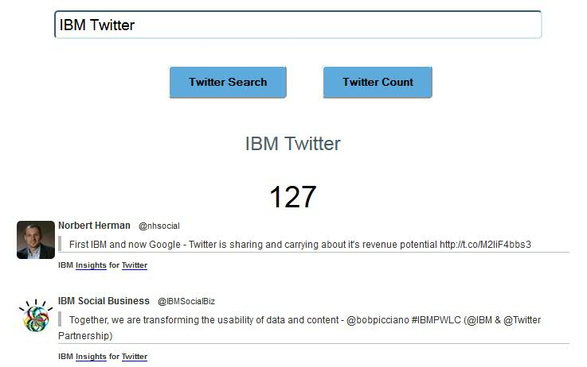
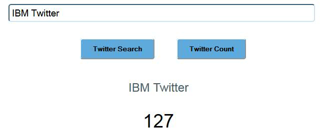

{:new_window: target="_blank"}
{:shortdesc: .shortdesc}
{:screen:.screen}
{:codeblock:.codeblock}

# Insights for Twitter examples
{: #examples}

*Last updated: 13 May 2016*

To get started with the {{site.data.keyword.twittershort}} service, use the provided samples to gain an understanding of how to leverage the service.
{: shortdesc}

## Insights for Twitter demo
{: #insights_twitter_demo}

A sample application is available for you to search Twitter data streams that use the {{site.data.keyword.twittershort}} service. The application is accessible by navigating to [https://cdetestapp.mybluemix.net/](https://cdetestapp.mybluemix.net/){: new.window}. The application opens in your browser and displays a search field, with **Twitter Search** and **Twitter Count** buttons. 


From the sample application, you can search for Tweets by using the supported parameters and operators described in [Query language](twitter_rest_apis.html#querylanguage){: new.window}. For example, entering "IBM Twitter" (with a space to denote a Boolean AND operation), and clicking **Twitter Search**, return Tweets that contain both terms.



With "IBM Twitter" specified in the search field, clicking **Twitter Count** returns the number of Tweets that contain both terms.



## Creating a rule track
{: #creating_rule_track}

As an Entry Plan user, you can create rule-based tracks to filter Tweets that are collected in the PowerTrack data stream. Examples in later sections demonstrate how to edit and delete tracks, as well as executing a search or count API call against the PowerTrack stream. To create a rule track, issue a **POST** request with the /api/v1/tracks operation, specify the track type (**Rule**), indicate an 'EndDate', and include at least one rule. The following snippet is an example request that includes two rules:

```
POST https://<username>:<password>@cdeservice.mybluemix.net:443/api/v1/tracks
HTTP/1.1 Content-Type: application/json
{
    "endDate": "2015-10-03T10:23:00Z",
    "name": "My First Rule Track",
    "type": "Rule",
    "rules": [
        {"value": "Canada"},
        {"value": "sport hockey"}
    ]
}
```

The `username` and `password` are unique to your application and service instance. This information can be obtained from the **VCAP_SERVICES** environment variables. For more information, see [Getting started with {{site.data.keyword.twittershort}}](index.html#insights_twitter_overview){: new.window}.

The body of the response appears similar to the following snippet:

```
HTTP/1.1 201 Created
Content-Type: application/json;charset=utf-8
Location: https://cdeservice.mybluemix.net:443/api/v1/tracks/66ff1961-51fe-4475-8bcd-c02f071d6fd1
{
    "id": "66ff1961-51fe-4475-8bcd-c02f071d6fd1",
    "type": "Rule",
    "state": "Active",
    "createdDate": "2015-08-06T20:38:28.940Z",
    "endDate": "2015-10-03T10:23:00Z",
    "name": "My First Rule Track",
    "rules": [
        {
          "id": "06497963-4fe3-47e8-90cd-aaef25f31314"
          "value": "Canada"
        },
        {
          "id": "d021165d-85e2-456a-af16-b9c026d76208",
          "value": "sport hockey"
        }
    ]
}
```

The response includes the unique ID that is associated with the newly created track. In addition, each rule is assigned a unique ID. The endDate indicates when the track stops collecting messages and must conform to UTC format (`YYYY-MM-DD` or `YYYY-MM-DDTHH:MM:SSZ`). The type property must be specified as either **Rule** or **Aggregated**. Since this example demonstrates the creation of a rules-based track, the **Rule** type was specified.

If the state property is not specified in the request, the track is created and is **Active**, by default. The name property is optional and is not required to be unique. To better manage your filters, selecting a unique and descriptive name is recommended.

For more detailed information on rules syntax, refer to the {{site.data.keyword.twittershort}} [Query language](twitter_rest_apis.html#querylanguage){: new.window}.

## Creating an aggregated track
{: #creating_aggregated_track}

As an Entry Plan user, you can create aggregated tracks that combine two or more existing tracks. Aggregated tracks can include both rule-based tracks and other aggregated tracks. Searching for Tweets from an aggregated track return results from its constituent tracks. To create an aggregated track, issue a **POST** request with the /api/v1/tracks operation, specify the track type (**Aggregated**), and include two or more trackIds. The following snippet is an example request that includes two tracks:

```
POST https://<username>:<password>@cdeservice.mybluemix.net:443/api/v1/tracks
HTTP/1.1 Content-Type: application/json
{
    "name": "My Aggregated Track",
    "type": "Aggregated",
    "trackIds": [
       {"id": "a22206cd-b72b-4b7d-a5a3-e2d08ce02a88"},
       {"id": "180356df-9a78-491e-b070-f3ffbe00bdf2"}
     ]
}
```
The `username` and `password` are unique to your application and service instance. This information can be obtained from the **VCAP_SERVICES** environment variables. For more information, see [Getting started with {{site.data.keyword.twittershort}}](index.html#insights_twitter_overview){: new.window}.

The body of the response appears similar to the following snippet:

```
HTTP/1.1 201 Created 
Content-Type: application/json;charset=utf-8
Location: https://cdeservice.mybluemix.net:443/api/v1/tracks/66ff1961-51fe-4475-8bcd-c02f071d6fd1
{
  "id": "9808fb82-7ea8-4b8e-9cd5-ad653a6dabe6",
  "type": "Aggregated",
  "createdDate": "2015-08-07T17:05:51.214Z",
  "name": "My Aggregated Track",
  "trackIds": [
    {
      "id": "a22206cd-b72b-4b7d-a5a3-e2d08ce02a88"
    },
    {
      "id": "180356df-9a78-491e-b070-f3ffbe00bdf2"
    }
  ]
}
```

The response includes the unique ID that is associated with the aggregated track. Unlike rule-based tracks, aggregated tracks do not include endDate or state properties, as these properties are managed within the individual rule-based tracks.

## Editing tracks
{: #editing_tracks}

Rule and aggregated tracks can be edited to refine how data is filtered in the PowerTrack stream. When rules are added (or modified) in existing tracks, messages that were retrieved based on earlier rules persist in the track. To ensure search results return data for the latest set of rules, delete the track and create a new track with the intended set of rules.

The example in [Creating a rule track](#creating_rule_track){: new.window} included two rules with a track ID of `66ff1961-51fe-4475-8bcd-c02f071d6fd1`. To add a new rule with a value of "Champions", use the POST /api/v1/tracks/{track Id} operation and append the new rule.

```
POST https://<username>:<password>@cdeservice.mybluemix.net:443/api/v1/tracks/66ff1961-51fe-4475-8bcd-c02f071d6fd1
HTTP/1.1 Content-Type: application/json
{
    "endDate": "2015-10-03T10:23:00Z",
    "name": "My First Rule Track",
    "type": "Rule",
    "rules": [
        {"value": "Canada"},
        {"value": "sport hockey"},
        {"value": "Champions"}
    ]
}
```
Similarly, you can remove rules from an existing track by issuing a GET /api/v1/tracks/{track Id} operation and remove unwanted rules.

The example in [Creating an aggregated track](#creating_aggregated_track) included two tracks. Another track, with ID `c4562594-1eeb-4a95-8fac-255428d74bce`, could be added to the existing aggregated track by issuing the following operation:

```
POST https://<username>:<password>@cdeservice.mybluemix.net:443/api/v1/tracks/9808fb82-7ea8-4b8e-9cd5-ad653a6dabe6
HTTP/1.1 Content-Type: application/json
{
  "trackIds": [
    {"id": "a22206cd-b72b-4b7d-a5a3-e2d08ce02a88"},
    {"id": "180356df-9a78-491e-b070-f3ffbe00bdf2"},
    {"id": "c4562594-1eeb-4a95-8fac-255428d74bce"}
  ]
}
```

## Deleting tracks
{: #deleting_tracks}

You can delete tracks that are no longer required by issuing a DELETE /api/v1/tracks/{trackId} operation. This action can be applied to both rule-based and aggregated tracks. Tracks that are included in an aggregated track cannot be deleted until the track is removed from all aggregated tracks. The following example demonstrates how to delete a track with ID `a22206cd-b72b-4b7d-a5a3-e2d08ce02a88`:

```
DELETE https://<username>:<password>@cdeservice.mybluemix.net:443/api/v1/tracks/a22206cd-b72b-4b7d-a5a3-e2d08ce02a88
HTTP/1.1
```

Alternatively, you can stop the collection of Tweets from a particular track by changing its state to Inactive. Instead of deleting the track, the following example disables the track:

```
POST https://<username>:<password>@cdeservice.mybluemix.net:443/api/v1/tracks/a22206cd-b72b-4b7d-a5a3-e2d08ce02a88
HTTP/1.1
{
    "state": "Inactive"
}
```

## Searching for Tweets
{: #searching_tweets}

You can issue a GET operation in your application to retrieve Tweets from either data stream. For example, searching for Decahose Tweets is implemented as: `/api/v1/messages/search?q=QUERY&size=NUMBER&from=NUMBER`. For Entry Plan users, searching for Tweets from the PowerTrack stream is implemented as: `/api/v1/tracks/{trackId}/messages/search?q=QUERY&size=NUMBER&from=NUMBER`.

The "size" parameter specifies the number of messages to return in a query response, while the "from" parameter indicates the initial message to return in the complete result set. The {trackId} reference is the unique identifier for a specific track.
Using cURL, you can search the Decahose stream for Tweets that contain "IBM" by typing:

```
curl https://<username>:<password>@cdeservice.mybluemix.net:443/api/v1/messages/search?q=IBM
```

Submitting the same query against the PowerTrack stream would be entered as: 

```
curl https://<username>:<password>@cdeservice.mybluemix.net:443/api/v1/tracks/{trackId}/messages/search?q=IBM
```

The `username` and `password` are unique to your application and service instance. This information can be obtained from the **VCAP_SERVICES** environment variables. For more information, see [Getting started with {{site.data.keyword.twittershort}}](index.html#insights_twitter_overview){: new.window}.

The service returns responses in JSON format. The following table lists the possible response codes.

| **HTTP Status Code** 	| **Reason**                                                           	|
|------------------	|------------------------------------------------------------------	|
| 200              	| OK                                                               	|
| 400              	| Invalid or missing request payload properties.                   	|
| 401              	| Authentication failed. Valid username and password are required. 	|
| 403              	| Forbidden, limit reached.                                        	|
| 500              	| An internal error has occurred.                                  	|

** Table 1. Response messages

The body of the response can appear as:

```
{
    "search": {
        "results": 16283624
    },
    "tweets": [{
        "message": {
            ...
            "body": "this is a nice tweet",
            "actor": {
                "followersCount”: 456,
                "displayName": "IBM Tweeter"
                ...
            },
            "cde": {
                "sentiment": {"polarity": "POSITIVE"...
                },
                "author": {"gender": "male"...
                },
                ...
            }
        }
    }]
}
```

The following URL-encoded query expression retrieves Tweets on a movie, based on a specified time frame and number of occurrences. This example could be used to determine the level of interest or reactions to a movie trailer.

```
/api/v1/messages/search?q=%28posted:2015-02-01T00:00:00Z%20AND%20%23americansniper%29&size=5 
```

By decoding the URL, the query syntax and operation becomes "(posted:2015-02-01T00:00:00Z AND #americansniper) &size=5".

## Counting number of Tweets
{: #counting_tweets}

You can apply a GET operation in your application to retrieve the number of Tweets that match a specified query. Queries to the Decahose are issued as: `/api/v1/messages/count?q=QUERY`, while calls against the PowerTrack stream use the following format: 

```
/api/v1/tracks/{trackId}/messages/count?q=QUERY
```

Using cURL, you can find the number of Tweets, in the Decahose, that contain "IBM" by using:

```
curl https://<username>:<password>@cdeservice.mybluemix.net:443/api/v1/messages/count?q=IBM
```

The same query can be issued against the PowerTrack data source as: 

```
curl https://<username>:<password>@cdeservice.mybluemix.net:443/api/v1/tracks/{trackId}/messages/count?q=IBM
```

The `username` and `password` are unique to your application and service instance. This information can be obtained from the **VCAP_SERVICES** environment variables. For more information, see [Getting started with {{site.data.keyword.twittershort}}](index.html#insights_twitter_overview){: new.window}.

The service returns responses in JSON format. The following table lists the possible response messages.

| **HTTP Status Code** 	| **Reason**                                                           	|
|------------------	|------------------------------------------------------------------	|
| 200              	| OK                                                               	|
| 400              	| Invalid or missing request payload properties.                   	|
| 401              	| Authentication failed. Valid username and password are required. 	|
| 403              	| Forbidden, limit reached.                                        	|
| 500              	| An internal error has occurred.                                  	|

**Table 2. Reponse messages**

The body of the response can appear as:
```
{
  "related": {
      "search": {
          "href": "https://server.bluemix.net/api/v1/messages/search?q=ibm" 
      }
  },
  "search": {
      "results": 21695
  }
}
```

The following query expression retrieves the number of positive Tweets that contain both "IBM" and "Bluemix". In this case, Tweets from the Decahose are returned in the response.

`.../api/v1/messages/count?q="IBM Bluemix sentiment:positive`

The following URL-encoded query expression retrieves the number of Tweets that contain "IBM" over a specified period. This sample query could help gauge the popularity of a subject and determine whether it's trending. Tweets from the PowerTrack stream are returned in this example.

`.../api/v1/tracks/{trackId}/messages/count?q=%28posted:2015-02-01T00:00:00Z,2015-02-15T00:00:00Z AND %23IBM%29`

By decoding the URL, the query syntax and operation becomes "(posted:2015-02-01T00:00:00Z,2015-02-15T00:00:00Z AND #IBM)".
