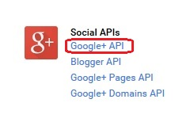
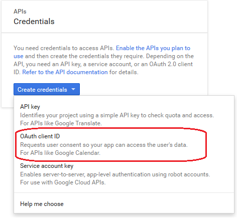

---

copyright:
  years: 2015, 2016

---

# Abilitazione dell'autenticazione Google nelle applicazioni Android
{: #google-auth-android}

## Prima di cominciare
{: #before-you-begin}

* Devi disporre di una risorsa protetta da {{site.data.keyword.amashort}} e di un progetto Android strumentato con l'SDK client {{site.data.keyword.amashort}}.  Per ulteriori informazioni, vedi [Introduzione a {{site.data.keyword.amashort}}](https://console.{DomainName}/docs/services/mobileaccess/getting-started.html) e [Configurazione
dell'SDK Android](https://console.{DomainName}/docs/services/mobileaccess/getting-started-android.html).
* Proteggi manualmente la tua applicazione di backend con l'SDK server {{site.data.keyword.amashort}}. Per ulteriori informazioni, vedi [Protezione delle risorse](https://console.{DomainName}/docs/services/mobileaccess/protecting-resources.html).

## Configurazione di un progetto Google per la piattaforma Android
{: #google-auth-android-project}
Per iniziare a usare Google come un provider di identità, creare un progetto nella Google Developers Console. Parte della creazione di un progetto consiste nell'ottenere un ID client Google.  L'ID client Google è un identificativo univoco per la tua applicazione utilizzato dall'autenticazione Google.

1. Crea un progetto nella [Google Developers Console](https://console.developers.google.com).
Se già hai un progetto, puoi tralasciare i passi che descrivono la creazione del progetto e iniziare con l'aggiunta delle credenziali.
   1.    Apri il menu di nuovo progetto. 
         
         

   2.    Fai clic su **Create a project**.
   
         


   1. Dall'elenco **Social APIs**, scegli **Google+ API**.

     

   1. Fai clic su **Enable** nella schermata successiva.

1. Seleziona la scheda **Consent Screen** e fornisci il nome prodotto visualizzato agli utenti. Altri valori sono facoltativi. Fai clic su **Save**.

    
    
1. Dall'elenco **Credentials**, scegli l'ID client OAuth.

     
     


1. Seleziona un tipo di applicazione. Fai clic su **Android**. Fornisci un nome significativo per il tuo client Android.

1. Per fare in modo che Google verifichi l'autenticità della tua applicazione, devi specificare un'impronta digitale di certificato di firma.

	 **Ulteriori informazioni sulla sicurezza Android:** il sistema operativo Android richiede che tutte le applicazioni installate su un dispositivo Android siano firmate con un certificato sviluppatore. Un'applicazione Android può essere messa a punto in due modalità: debug e rilascio. È di norma consigliato disporre di certificati differenti per le modalità di debug e rilascio.  I certificati utilizzati per firmare le applicazioni Android in modalità di debug sono forniti con l'SDK Android.  L'SDK Android è in genere installato automaticamente da Android Studio. Quando vuoi rilasciare la tua applicazione a Google Play, devi firmare la tua applicazione con un altro certificato che di norma generi tu stesso. Per ulteriori informazioni,
vedi il documento relativo alla [firma delle tue applicazioni Android](http://developer.android.com/tools/publishing/app-signing.html).

1. Un keystore che contiene un certificato per gli ambienti di sviluppo è memorizzato in un file `~/.android/debug.keystore`. La password keystore predefinita è: `android`. Questo certificato viene utilizzato per mettere a punto applicazioni in modalità di debug.

     1. Recupera la tua impronta digitale di certificato di firma:

	```XML
	keytool -exportcert -alias androiddebugkey -keystore ~/.android/debug.keystore -list -v
	```
	Puoi utilizzare la stessa sintassi anche per recuperare l'hash chiave del tuo certificato di modalità di rilascio. Sostituisci percorso keystore e alias nel comando.

1. Trova la riga che inizia con `SHA1` sotto **Certificate Fingerprints**. Copia l'impronta digitale ottenuta
eseguendo il comando **keytool** nella Google Developers Console.

1. Specifica il nome pacchetto della tua applicazione Android. Per trovare il nome pacchetto della tua applicazione Android, apri
il file `AndroidManifest.xml` in Android Studio e cerca: `<manifest package="{il-tuo-nome-pacchetto}">`. Al termine, fai
clic su **Crea**.

Viene presentata una finestra di dialogo che visualizza il tuo ID client Google. Annota questo valore. Devi registrare questo valore presso {{site.data.keyword.Bluemix}}.


## Configurazione di {{site.data.keyword.amashort}} per l'autenticazione Google
{: #google-auth-android-config}

Ora che hai un ID client Google per Android, puoi abilitare l'autenticazione Google nel dashboard {{site.data.keyword.amashort}}.

1. Apri la tua applicazione nel dashboard {{site.data.keyword.Bluemix_notm}}.

1. Fai clic su **Opzioni mobili** e annota la tua **Rotta** (`applicationRoute`) e il tuo **GUID applicazione** (`applicationGUID`). Questi valori ti servono quando inizializzi l'SDK.

1. Fai clic sul tile {{site.data.keyword.amashort}}. Il dashboard {{site.data.keyword.amashort}} viene caricato.

1. Fai clic sul tile **Google**.

1. In **Application ID for Android**, specifica il tuo ID client Google per Android e fai clic su **Save**.

## Configurazione dell'SDK client {{site.data.keyword.amashort}} per Android
{: #google-auth-android-sdk}

1. Ritorna ad Android Studio.

1. Apri il file `build.gradle` del tuo modulo applicazione.

	Il tuo progetto Android può avere due file `build.gradle`: uno per il progetto e un altro per il modulo applicazione. Utilizza il modulo applicazione.

  Trova la sezione delle dipendenze e aggiungi una nuova dipendenza di compilazione per l'SDK client:

	```Gradle
	dependencies {
		compile group: 'com.ibm.mobilefirstplatform.clientsdk.android',    
        name:'googleauthentication',
        version: '2.+',
        ext: 'aar',
        transitive: true
    	// altr dipendenze  
	}
	```

	Puoi rimuovere la dipendenza sul modulo `core` del gruppo `com.ibm.mobilefirstplatform.clientsdk.android`, se ne disponi. Il modulo `googleauthentication` viene scaricato automaticamente per tuo conto. Il modulo `googleauthentication` scarica e installa l'SDK Google nel tuo progetto Android.

1. Sincronizza il tuo progetto con Gradle facendo clic su **Tools > Android > Sync Project with Gradle Files**.

1. Apri il file `AndroidManifest.xml` del tuo progetto Android.

1. Aggiungi l'autorizzazione di accesso a internet sotto l'elemento `<manifest>`:

	```XML
	<uses-permission android:name="android.permission.INTERNET" />
	<uses-permission android:name="android.permission.GET_ACCOUNTS" />
	<uses-permission android:name="android.permission.USE_CREDENTIALS" />
	```

1. Per utilizzare l'SDK client {{site.data.keyword.amashort}}, devi inizializzarlo passando i parametri context, applicationGUID e applicationRoute.

	Un punto comune, seppure non obbligatorio, dove inserire il codice di inizializzazione è nel metodo onCreate dell'attività principale nella tua applicazione Android

1. Inizializza l'SDK client e registra il gestore autenticazione Google. Sostituisci *applicationRoute* e *applicationGUID* con i
valori da **Rotta** e **GUID applicazione** dalla sezione **Opzioni mobili** nel dashboard.

	```Java
	BMSClient.getInstance().initialize(getApplicationContext(),
					"applicationRoute",
					"applicationGUID");

	GoogleAuthenticationManager.getInstance().register(this);
	```

1. Aggiungi il seguente codice alla tua attività:

	```Java
	@Override
	protected void onActivityResult(int requestCode, int resultCode, Intent data) {
		super.onActivityResult(requestCode, resultCode, data);
		GoogleAuthenticationManager.getInstance()
			.onActivityResultCalled(requestCode, resultCode, data);
	}
	```

## Verifica dell'autenticazione
{: #google-auth-android-test}
Dopo che l'SDK client è stato inizializzato e il gestore autenticazione Google è stato registrato, puoi iniziare a effettuare richieste al tuo backend mobile.

### Prima di cominciare
{: #google-auth-android-testing-before}
Devi disporre di un backend mobile creato con il contenitore tipo MobileFirst Services Starter e disporre già di una risorsa protetta da
{{site.data.keyword.amashort}} all'endpoint `/protected`. per ulteriori informazioni, consulta [Protezione delle risorse](https://console.{DomainName}/docs/services/mobileaccess/protecting-resources.html)

1. Prova a inviare una richiesta all'endpoint protetto del tuo backend mobile nel tuo browser desktop aprendo `{applicationRoute}/protected`, ad esempio: `http://my-mobile-backend.mybluemix.net/protected`.
 L'endpoint `/protected` di un backend mobile creato con il contenitore tipo MobileFirst Services è protetto con {{site.data.keyword.amashort}}. Pertanto, a esso possono accedere solo le applicazioni mobili strumentate con l'SDK client {{site.data.keyword.amashort}}. Di conseguenza, vedrai `Unauthorized` nel tuo browser del desktop.

1. Utilizza la tua applicazione Android per effettuare una richiesta allo stesso endpoint. Aggiungi il seguente codice dopo che hai inizializzato l'istanza `BMSClient` e registrato `GoogleAuthenticationManager`.

	```Java
	Request request = new Request("/protected", Request.GET);
	request.send(this, new ResponseListener() {
		@Override
		public void onSuccess (Response response) {
			Log.d("Myapp", "onSuccess :: " + response.getResponseText());
			Log.d("MyApp", AuthorizationManager.getInstance().getUserIdentity().toString());
		}
		@Override
		public void onFailure (Response response, Throwable t, JSONObject extendedInfo) {
			if (null != t) {
				Log.d("Myapp", "onFailure :: " + t.getMessage());
			} else if (null != extendedInfo) {
				Log.d("Myapp", "onFailure :: " + extendedInfo.toString());
			} else {
				Log.d("Myapp", "onFailure :: " + response.getResponseText());
			}
		}
	});
```

1. Esegui la tua applicazione. Viene visualizzata una schermata di accesso a Google. Dopo l'accesso, l'applicazione richiede l'autorizzazione ad accedere alle risorse.

	

	A seconda del tuo dispositivo Android e del fatto che tu sia collegato o meno a Google, potresti avere un'interfaccia utente diversa.

  Facendo clic su **OK**, stai autorizzando {{site.data.keyword.amashort}} a utilizzare la tua identità utente Google per scopi di autenticazione.

1. 	Dopo che la tua richiesta ha avuto esito positivo, puoi vedere il seguente output nello strumento LogCat:

	

1. Puoi anche aggiungere la funzionalità di disconnessione aggiungendo il seguente codice:

 ```Java
 GoogleAuthenticationManager.getInstance().logout(getApplicationContext(),, listener);
 ```

 Se richiami questo codice dopo che un utente ha eseguito l'accesso con Google, l'utente viene disconnesso da Google. Quando l'utente prova ad eseguire nuovamente l'accesso, deve selezionare un account Google con il quale verrà nuovamente eseguito il suo accesso. Quando prova ad accedere con un ID Google che aveva già in precedenza eseguito l'accesso, non gli vengono richieste nuovamente le credenziali. Perché gli vengano richieste nuovamente le credenziali di accesso, è necessario che l'utente rimuova il suo account Google dal dispositivo Android.

 Il valore per `listener` passato alla funzione di disconnessione può essere null.
