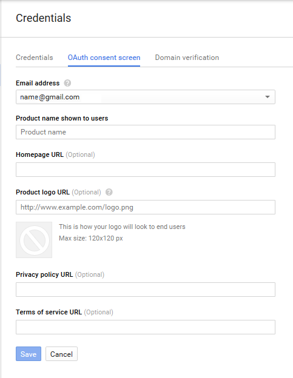

---

copyright:
  years: 2015, 2016

---

# 在 Android 应用程序中启用 Google 认证
{: #google-auth-android}

## 开始之前
{: #before-you-begin}

* 您必须具有受 {{site.data.keyword.amashort}} 保护的资源，并且具有安装了 {{site.data.keyword.amashort}} 客户端 SDK 的 Android 项目。有关更多信息，请参阅 [{{site.data.keyword.amashort}} 入门](https://console.{DomainName}/docs/services/mobileaccess/getting-started.html)和[设置 Android SDK](https://console.{DomainName}/docs/services/mobileaccess/getting-started-android.html)。  
* 使用 {{site.data.keyword.amashort}} 服务器 SDK 手动保护后端应用程序。有关更多信息，请参阅[保护资源](https://console.{DomainName}/docs/services/mobileaccess/protecting-resources.html)。

## 针对 Android 平台配置 Google 项目
{: #google-auth-android-project}
要开始将 Google 用作身份提供者，请在 Google 开发者控制台中创建项目。创建项目的步骤之一是获取 Google 客户端标识。Google 客户端标识是 Google 认证针对您的应用程序使用的唯一标识。

1. 在 [Google 开发者控制台](https://console.developers.google.com)中创建项目。如果已经有项目，那么可以跳过描述项目创建的步骤，而开始添加凭证。
   1.    打开新项目菜单。 
         
         

   2.    单击**创建项目**。
   
         


   1. 从**社交 API** 列表中，选择 **Google+ API**。

     

   1. 在下一个屏幕中，单击**启用**。

1. 选择**同意屏幕**选项卡，然后提供向用户显示的产品名称。其他值为可选项。单击 **保存**。

    
    
1. 从**凭证**列表中，选择 OAuth 客户端标识。

     
     


1. 选择应用程序类型。单击 **Android**。为 Android 客户端提供有意义的名称。

1. 为了让 Google 验证您的应用程序真实性，必须指定签署证书指纹。

	 **关于 Android 安全性的更多信息：**Android 操作系统需要安装在 Android 设备上的所有应用程序都使用开发者证书进行签署。Android 应用程序可以通过两种方式进行构建：调试和发布。通常建议对于调试和发布方式使用不同的证书。用于在调试方式下签署 Android 应用程序的证书会与 Android SDK 捆绑在一起。Android SDK 通常由 Android Studio 自动安装。当您希望将应用程序发布到 Google Play 时，必须使用通常由您自行生成的其他证书来签署应用程序。有关更多信息，请参阅 [signing your Android applications](http://developer.android.com/tools/publishing/app-signing.html)。

1. 包含用于开发环境的证书的密钥库存储在 `~/.android/debug.keystore` 文件中。缺省密钥库密码为 `android`。此证书用于在调试方式下构建应用程序。

     1. 检索签署证书指纹：

	```XML
	keytool -exportcert -alias androiddebugkey -keystore ~/.android/debug.keystore -list -v
	```
	还可以使用相同的语法来检索发布方式证书的密钥散列。请替换命令中的别名和密钥库路径。

1. 在**证书指纹**下，找到以 `SHA1` 开头的行。将通过运行 **keytool** 命令获得的指纹复制到 Google 开发者控制台。

1. 指定 Android 应用程序的软件包名称。要找到 Android 应用程序的软件包名称，请在 Android Studio 中打开 `AndroidManifest.xml` 文件，然后查找：`<manifest package="{your-package-name}">`。完成后，单击**创建**。

此时将出现对话框，其中显示您的 Google 客户端标识。请记录此值。您需要在 {{site.data.keyword.Bluemix}} 上注册此值。


## 配置 {{site.data.keyword.amashort}} 进行 Google 认证
{: #google-auth-android-config}

现在，您已经具有 Android 的 Google 客户端标识，可以在 {{site.data.keyword.amashort}}“仪表板”中启用 Google 认证。

1. 在 {{site.data.keyword.Bluemix_notm}}“仪表板”中打开应用程序。

1. 单击**移动选项**，然后记录**路径** (`applicationRoute`) 和**应用程序 GUID** (`applicationGUID`)。初始化 SDK 时需要这些值。

1. 单击 {{site.data.keyword.amashort}} 磁贴。这将装入 {{site.data.keyword.amashort}}“仪表板”。

1. 单击 **Google** 磁贴。

1. 在 **Android 的应用程序标识**中，指定 Android 的 Google 客户端标识，然后单击**保存**。

## 针对 Android 配置 {{site.data.keyword.amashort}} 客户端 SDK
{: #google-auth-android-sdk}

1. 返回到 Android Studio。

1. 打开应用程序模块的 `build.gradle` 文件。

	Android 项目可能具有两个 `build.gradle` 文件：一个用于项目，另一个用于应用程序模块。请使用用于应用程序模块的文件。

  找到 dependencies 部分，并为客户端 SDK 添加新的编译依赖关系：

	```Gradle
	dependencies {
		compile group: 'com.ibm.mobilefirstplatform.clientsdk.android',    
        name:'googleauthentication',
        version: '2.+',
        ext: 'aar',
        transitive: true
    	// other dependencies  
	}
	```

	您可以除去对 `com.ibm.mobilefirstplatform.clientsdk.android` 组的 `core` 模块的依赖关系（如有）。`googleauthentication` 模块会自动下载此依赖关系。`googleauthentication` 模块会下载 Google SDK 并将其安装在 Android 项目中。

1. 通过单击**工具 > Android > 使用 Gradle 文件同步项目**来使用 Gradle 同步项目。

1. 打开 Android 项目的 `AndroidManifest.xml` 文件。

1. 在 `<manifest>` 元素下添加因特网访问许可权：

	```XML
	<uses-permission android:name="android.permission.INTERNET" />
	<uses-permission android:name="android.permission.GET_ACCOUNTS" />
<uses-permission android:name="android.permission.USE_CREDENTIALS" />
	```

1. 要使用 {{site.data.keyword.amashort}} 客户端 SDK，您必须通过传递 context、applicationGUID 和 applicationRoute 参数来对其进行初始化。

	在 Android 应用程序中，通常会将初始化代码放置在主 Activity 的 onCreate 方法中，但这不是强制性的

1. 初始化客户端 SDK，然后注册 Google 认证管理器。将 *applicationRoute* 和 *applicationGUID* 替换为仪表板中**移动选项**部分中的**路径**和**应用程序 GUID** 值。

	```Java
	BMSClient.getInstance().initialize(getApplicationContext(),
					"applicationRoute",
					"applicationGUID");

	GoogleAuthenticationManager.getInstance().register(this);```

1. 将以下代码添加到您的 Activity：

	```Java
	@Override
	protected void onActivityResult(int requestCode, int resultCode, Intent data) {
		super.onActivityResult(requestCode, resultCode, data);
		GoogleAuthenticationManager.getInstance()
			.onActivityResultCalled(requestCode, resultCode, data);
	}
	```

## 测试认证
{: #google-auth-android-test}
初始化客户端 SDK 并注册 Google 认证管理器后，可以开始对移动后端发起请求。

### 开始之前
{: #google-auth-android-testing-before}
必须具有使用 MobileFirst Services Starter 样板创建的移动后端，并且在 `/protected` 端点必须已经具有受 {{site.data.keyword.amashort}} 保护的资源。有关更多信息，请参阅[保护资源](https://console.{DomainName}/docs/services/mobileaccess/protecting-resources.html)

1. 尝试通过在桌面浏览器中打开 `{applicationRoute}/protected`（例如，`http://my-mobile-backend.mybluemix.net/protected`），向移动后端的受保护端点发送请求。使用 MobileFirst Services 样板创建的移动后端的 `/protected` 端点通过 {{site.data.keyword.amashort}} 进行保护。所以此端点只能由安装了 {{site.data.keyword.amashort}} 客户端 SDK 的移动应用程序进行访问。因此，您会在桌面浏览器中看到 `Unauthorized`。

1. 使用 Android 应用程序对同一端点发起请求。初始化 `BMSClient` 实例并注册 `GoogleAuthenticationManager` 后，添加以下代码。

	```Java
	Request request = new Request("/protected", Request.GET);
	request.send(this, new ResponseListener() {
		@Override
		public void onSuccess (Response response) {
			Log.d("Myapp", "onSuccess :: " + response.getResponseText());
			Log.d("MyApp", AuthorizationManager.getInstance().getUserIdentity().toString());
		}
		@Override
		public void onFailure (Response response, Throwable t, JSONObject extendedInfo) {
			if (null != t) {
				Log.d("Myapp", "onFailure :: " + t.getMessage());
			} else if (null != extendedInfo) {
				Log.d("Myapp", "onFailure :: " + extendedInfo.toString());
			} else {
				Log.d("Myapp", "onFailure :: " + response.getResponseText());
			}
		}
	});
```

1. 运行应用程序。这将弹出 Google 登录屏幕。登录之后，应用程序将请求授予许可权以访问资源：

	

	根据您的 Android 设备以及您当前是否登录到 Google，您看到的 UI 可能会不同。

  通过单击**确定**，您将授权 {{site.data.keyword.amashort}} 使用您的 Google 用户身份进行认证。

1. 	请求成功后，可在 LogCat 工具中看到以下输出：

	

1. 通过添加以下代码，您还可以添加注销功能：

 ```Java
 GoogleAuthenticationManager.getInstance().logout(getApplicationContext(),, listener);
 ```

 如果您在用户登录 Google 之后调用此代码，那么用户将从 Google 注销。当用户尝试重新登录时，他们必须重新选择将要登录的 Google 帐户。如果他们尝试登录先前所登录的 Google 标识，那么不再提示用户输入凭证。如果要重新提示输入登录凭证，用户必须从 Android 设备移除其 Google 帐户。

 传递给注销功能的 `listener` 值可以为空值。
